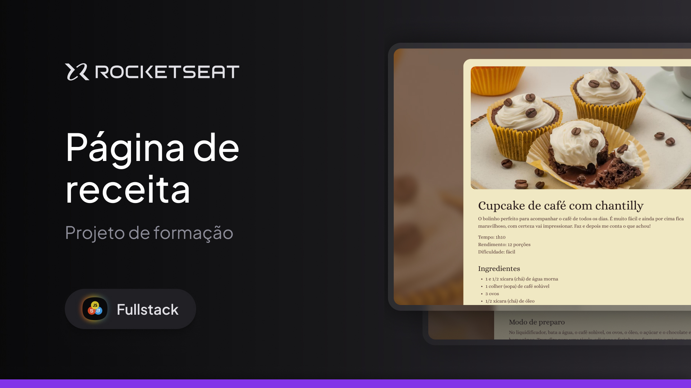

<h1 align="center"> Página de Receita </h1>

<h2>Fala dev 👋🏼<h2>
Boas-vindas ao projeto Página de receita
Nesse projeto eu desenvolvi uma página simples de receita.    

Esse é um dos projetos desenvolvidos em aula na formação Full-stack, um dos conteúdos de especialização da Rocketseat.  

  <a href="#-tecnologias">Tecnologias</a>&nbsp;&nbsp;&nbsp;|&nbsp;&nbsp;&nbsp;
  <a href="#-projeto">Projeto</a>&nbsp;&nbsp;&nbsp;|&nbsp;&nbsp;&nbsp;
  <a href="#-layout">Layout</a>&nbsp;&nbsp;&nbsp;|&nbsp;&nbsp;&nbsp;
  <a href="#memo-licença">Licença</a>

  

 

  

## 🚀 Tecnologias

Esse projeto foi desenvolvido com as seguintes tecnologias:

- HTML e CSS
- Git e Github
- Figma

## 💻 Projeto

Nesse projeto você vai desenvolver uma página simples de receita.

- [Acesse o projeto finalizado, online](https://caio-vinicius-almeida.github.io/Pagina-de-receita-Rocketseat/)

## 🔖 Layout

Você pode visualizar o layout do projeto através [DESSE LINK](https://www.figma.com/community/file/1360315130061454535). É necessário ter conta no [Figma](https://figma.com) para acessá-lo.

## :memo: Licença

Esse projeto está sob a licença MIT.

---

Feito com ♥ by Rocketseat :wave: [Participe da nossa comunidade!](https://discord.gg/rocketseat)
